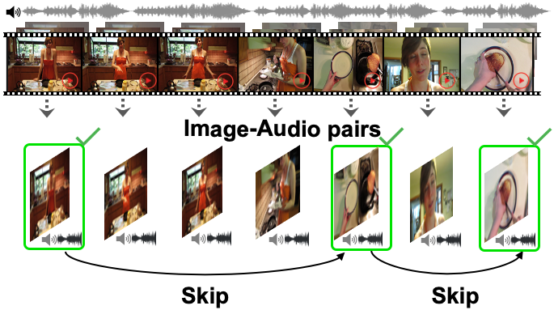

## Listen to Look: Action Recognition by Previewing Audio (CVPR 2020)
[[Project Page]](http://vision.cs.utexas.edu/projects/listen_to_look/)    [[arXiv]](https://arxiv.org/abs/1912.04487) 



<br/>

[Listen to Look: Action Recognition by Previewing Audio](https://arxiv.org/abs/1912.04487)  
 [Ruohan Gao](https://www.cs.utexas.edu/~rhgao/)<sup>1,2</sup>,  [Tae-Hyun Oh](https://thohkaistackr.wixsite.com/page)<sup>1</sup>,  [Kristen Grauman](http://www.cs.utexas.edu/~grauman/)<sup>1,2</sup>, [Lorenzo Torresani](https://www.cs.dartmouth.edu/~lorenzo/home.html)<sup>2</sup> <br/>
 <sup>1</sup>UT Austin, <sup>2</sup>Facebook AI Research  
 In Conference on Computer Vision and Pattern Recognition (**CVPR**), 2020  
 
<br/>

If you find our code or project useful in your research, please cite:

    @inproceedings{gao2020listentolook,
      title = {Listen to Look: Action Recognition by Previewing Audio},
      author = {Gao, Ruohan and Oh, Tae-Hyun, and Grauman, Kristen and Torresani, Lorenzo},
      booktitle = {CVPR},
      year = {2020}
    }

### Preparation
The image features, audio features, and image-audio features for ActivityNet are shared at [this link](https://utexas.box.com/s/8rxijymjo0kx4e9jk7byobdc8vnf377l). After IMGAUD2VID distillation on Kinetics, we fine-tune the image-audio network for action classification on AcitivityNet. The image features, audio features, and image-audio features after the fusion layer (see Fig.2 in the paper) are extracted from the fine-tuned image-audio network. The image-audio model fine-tuned on ActivityNet and the pickle files of the paths to the image-audio features are also shared.

### Training and Testing
(The code has beed tested under the following system environment: Ubuntu 18.04.3 LTS, CUDA 10.0, Python 3.7.3, PyTorch 1.0.1)
1. Download the extracted features and the fine-tuned image-audio model for ActivityNet, and prepare the pickle file accordingly by changing to paths to have the correct root prefix of your own.

2. Use the following command to train the video preview model:
```
python main.py \
--train_dataset_file '/your_pickle_file_root_path/train.pkl' \
--test_dataset_file '/your_pickle_file_root_path/val.pkl' \
--batch_size 256 \
--warmup_epochs 0 \
--epochs 25 \
--lr 0.01 \
--milestones 15 20 \
--momentum 0.9 \
--decode_threads 10 \
--scheduler \
--num_classes 200 \
--weights_audioImageModel '/your_model_root_path/ImageAudioNet_ActivityNet.pth' \
--checkpoint_freq 10 \
--episode_length 10 \
--checkpoint_path './checkpoints/exp' \
--freeze_imageAudioNet \
--with_avgpool_ce_loss \
--compute_mAP \
--mean_feature_as_start \
--subsample_factor 1 \
--with_replacement |& tee -a logs/exp.log
```

3. Use the following command to test your trained model:
```
python validate.py \
--test_dataset_file '/your_pickle_file_root_path/val.pkl' \
--batch_size 256 \
--decode_threads 10 \
--scheduler \
--num_classes 200 \
--episode_length 10 \
--pretrained_model './checkpoints/exp/model_final.pth' \
--with_replacement \
--mean_feature_as_start \
--feature_interpolate \
--subsample_factor 1 \
--compute_mAP
```

### Acknowlegements
Portions of the code are borrowed or adapted from Bruno Korbar and Zuxuan Wu. Thanks for their help!

### Licence
The code for Listen to Look is CC BY 4.0 licensed, as found in the LICENSE file.
